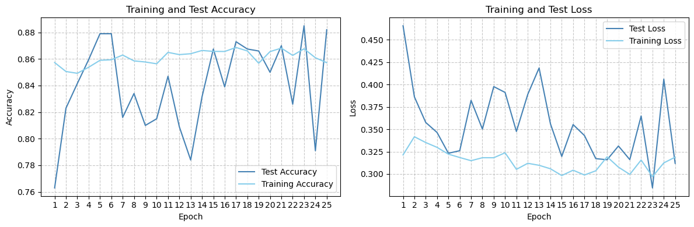
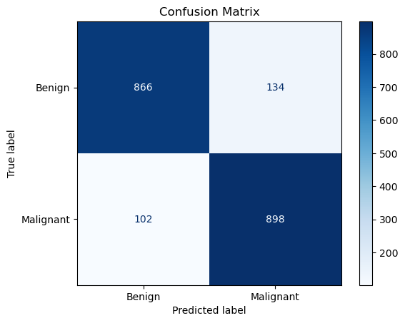
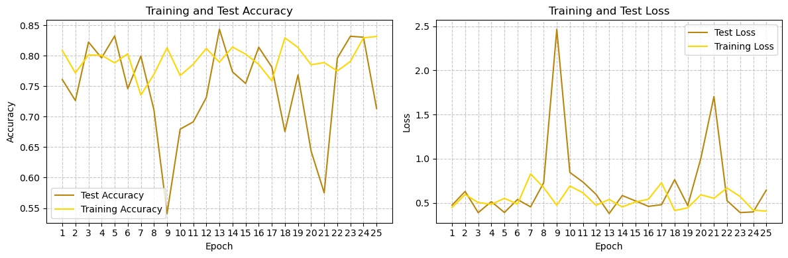
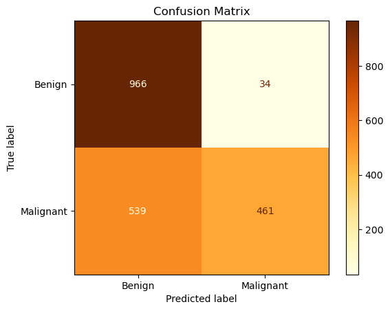
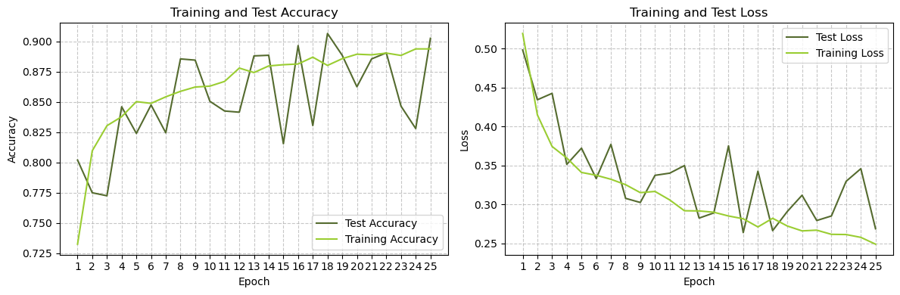
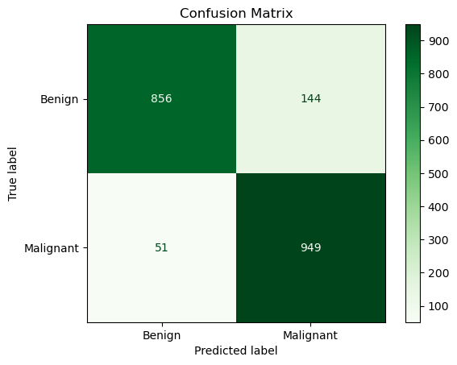
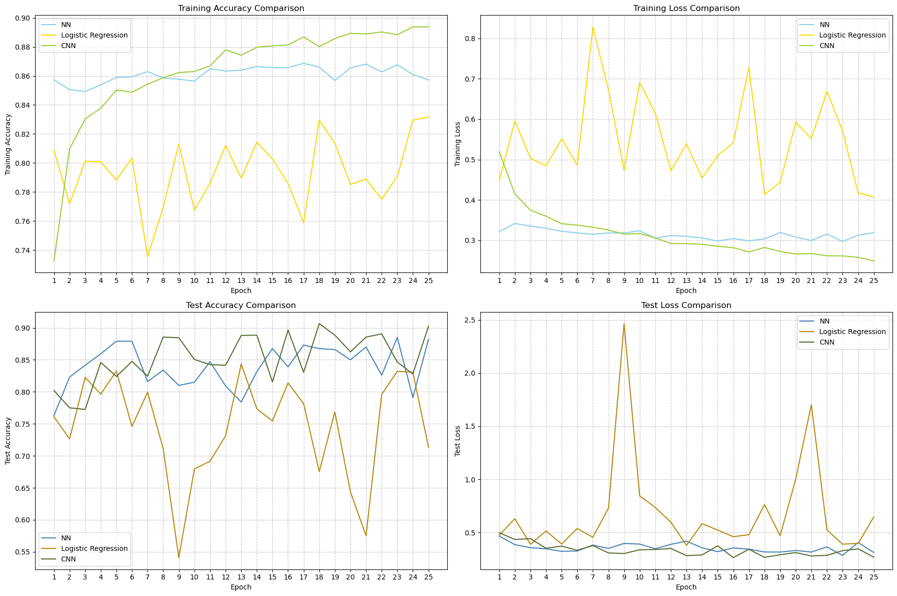

# Skin Cancer Detection models 🩺 | CNN, NN and Logistic Regression

#### Prologue
This notebook explores melanoma classification using machine learning.
The objective is **construct** and **analyze** three models: a neural network, logistic regression, and a CNN.

#### Dataset Overview
Comprising 13,900 uniformly-sized images at 224 x 224 pixels, which provides a comprehensive portrayal of diverse manifestations of melanoma. Each image is meticulously labeled as either `benign` or `malignant`.


```python
import os
import random
#----------
import tensorflow as tf
from tensorflow.keras.models import Sequential
from tensorflow.keras.layers import Flatten, Dense, Dropout, Conv2D, MaxPooling2D
from tensorflow.keras.preprocessing.image import ImageDataGenerator
#----------
from sklearn.metrics import confusion_matrix, ConfusionMatrixDisplay
from sklearn.metrics import classification_report, mean_squared_error, accuracy_score, precision_score, recall_score
#----------
import matplotlib.pyplot as plt
#----------
import numpy as np
#----------
import warnings
warnings.filterwarnings('ignore')
```

## Load and preprocess the dataset


```python
# Path to the dataset archive
archive_path = r'parth\to\archive'
```


```python
# Define the main folder path after extraction
main_folder_path = os.path.splitext(archive_path)[0]  # Remove the extension
```

The main folder contains 2 folders - train and test - and each of them conatins 2 folder - Benign and Malignant


```python
# Define subfolders
data_folders = ["train", "test"]
class_folders = ["Benign", "Malignant"]
```


```python
# Paths for train and test data
train_data_path = os.path.join(main_folder_path, data_folders[0])
test_data_path = os.path.join(main_folder_path, data_folders[1])
```

Set those hyperparamaters as you wish


```python
img_width, img_height = 112, 112 
batch_size = 128
epochs = 25
```


```python
# Data generators
train_datagen = ImageDataGenerator(rescale=1.0 / 255)
test_datagen = ImageDataGenerator(rescale=1.0 / 255)

train_generator = train_datagen.flow_from_directory(
    train_data_path,
    target_size=(img_width, img_height),
    batch_size=batch_size,
    class_mode='binary'
)

test_generator = test_datagen.flow_from_directory(
    test_data_path,
    target_size=(img_width, img_height),
    batch_size=batch_size,
    class_mode='binary',
    shuffle=False
)
```

    Found 11879 images belonging to 2 classes.
    Found 2000 images belonging to 2 classes.
    

### Samples Examples


```python
# Get the first batch from the training generator
x_batch, y_batch = next(train_generator)

# Extract features and label from the first element in the batch
first_features = x_batch[0]
first_label = y_batch[0]

# Get the mapping of class indices to class names
class_indices = train_generator.class_indices

# Reverse the mapping to get class names to class indices
class_names = {v: k for k, v in class_indices.items()}

# Extract the numerical label of the first element in the batch
numerical_label = int(first_label)

# Get the corresponding class name
label_name = class_names[numerical_label]
print(int(first_label), "stands for", label_name)
```

    1 stands for Malignant
    


```python
# Display information about the dataset
shapes = np.shape(train_generator[0][0])
print("A batch contains", shapes[0], "samples of", shapes[1], "x", shapes[2], "x", shapes[3])
```

    A batch contains 128 samples of 112 x 112 x 3
    


```python
# Select 3 random indices from the list
random_indices = random.sample(range(len(train_generator)), 3)

# Display the selected images in a 3x1 grid
fig, axes = plt.subplots(1, 3, figsize=(12, 4))

for i, index in enumerate(random_indices):
    # Show each image
    image = train_generator[index][0][0]
    axes[i].imshow(image)
    axes[i].axis('off')

plt.tight_layout()
plt.show()
```


    

    


# Models

This section involves constructing three models: a Neural Network (NN), Logistic Regression, and Convolutional Neural Network (CNN). Each model is analyzed individually, followed by a comparative evaluation to discern their respective performance characteristics.

## Neural Network 

### Creation


```python
def create_nn(num_hidden_layers, hidden_layer_sizes):
    """
    Create a neural network with dynamic hidden layers.

    Parameters:
    - num_hidden_layers: Integer specifying the number of hidden layers for each set of sizes.
    - hidden_layer_size: List of integers specifying the size of each hidden layer.
    """
    model = Sequential()
    
    # Flatten the input data
    model.add(Flatten(input_shape=(img_width, img_height, 3)))

    # Add hidden layers
    for i in range(num_hidden_layers):
        model.add(tf.keras.layers.Dense(hidden_layer_sizes[i], activation='relu'))
            
    # Output layer with binary classification
    model.add(Dense(1, activation='sigmoid')) 

    # Compile the model
    model.compile(
        optimizer='adam',
        loss='binary_crossentropy',
        metrics=['accuracy'])

    return model
```


```python
# Define NN sizes
hidden_layer_sizes = [64, 32, 32]
num_hidden_layers = len(hidden_layer_sizes)

# Get the NN model
nn_model = create_nn(num_hidden_layers, hidden_layer_sizes)

# Display the model architecture
nn_model.summary()
```

    Model: "sequential"
    _________________________________________________________________
     Layer (type)                Output Shape              Param #   
    =================================================================
     flatten (Flatten)           (None, 37632)             0         
                                                                     
     dense (Dense)               (None, 64)                2408512   
                                                                     
     dense_1 (Dense)             (None, 32)                2080      
                                                                     
     dense_2 (Dense)             (None, 32)                1056      
                                                                     
     dense_3 (Dense)             (None, 1)                 33        
                                                                     
    =================================================================
    Total params: 2411681 (9.20 MB)
    Trainable params: 2411681 (9.20 MB)
    Non-trainable params: 0 (0.00 Byte)
    _________________________________________________________________
    


```python
# Compile model
nn_model.compile(optimizer='adam', 
              loss='binary_crossentropy',
              metrics=['accuracy'])
```

### Training and evaluating


```python
history = nn_model.fit(train_generator, epochs=epochs, validation_data=test_generator)

# Evaluate the model
test_loss, test_acc = nn_model.evaluate(test_generator)
print(f'Test Accuracy: {test_acc}')
```

    Epoch 1/25
    93/93 [==============================] - 78s 836ms/step - loss: 0.3214 - accuracy: 0.8573 - val_loss: 0.4656 - val_accuracy: 0.7630
    Epoch 2/25
    93/93 [==============================] - 23s 243ms/step - loss: 0.3417 - accuracy: 0.8506 - val_loss: 0.3862 - val_accuracy: 0.8230
    Epoch 3/25
    93/93 [==============================] - 23s 247ms/step - loss: 0.3352 - accuracy: 0.8492 - val_loss: 0.3576 - val_accuracy: 0.8415
    Epoch 4/25
    93/93 [==============================] - 22s 236ms/step - loss: 0.3298 - accuracy: 0.8538 - val_loss: 0.3464 - val_accuracy: 0.8595
    Epoch 5/25
    93/93 [==============================] - 31s 337ms/step - loss: 0.3222 - accuracy: 0.8590 - val_loss: 0.3232 - val_accuracy: 0.8790
    Epoch 6/25
    93/93 [==============================] - 32s 340ms/step - loss: 0.3184 - accuracy: 0.8594 - val_loss: 0.3260 - val_accuracy: 0.8790
    Epoch 7/25
    93/93 [==============================] - 22s 235ms/step - loss: 0.3149 - accuracy: 0.8630 - val_loss: 0.3823 - val_accuracy: 0.8160
    Epoch 8/25
    93/93 [==============================] - 23s 251ms/step - loss: 0.3182 - accuracy: 0.8586 - val_loss: 0.3502 - val_accuracy: 0.8340
    Epoch 9/25
    93/93 [==============================] - 22s 238ms/step - loss: 0.3182 - accuracy: 0.8577 - val_loss: 0.3977 - val_accuracy: 0.8100
    Epoch 10/25
    93/93 [==============================] - 22s 240ms/step - loss: 0.3237 - accuracy: 0.8564 - val_loss: 0.3911 - val_accuracy: 0.8150
    Epoch 11/25
    93/93 [==============================] - 22s 238ms/step - loss: 0.3052 - accuracy: 0.8650 - val_loss: 0.3475 - val_accuracy: 0.8470
    Epoch 12/25
    93/93 [==============================] - 22s 242ms/step - loss: 0.3120 - accuracy: 0.8633 - val_loss: 0.3889 - val_accuracy: 0.8090
    Epoch 13/25
    93/93 [==============================] - 35s 379ms/step - loss: 0.3097 - accuracy: 0.8640 - val_loss: 0.4185 - val_accuracy: 0.7840
    Epoch 14/25
    93/93 [==============================] - 31s 336ms/step - loss: 0.3059 - accuracy: 0.8664 - val_loss: 0.3561 - val_accuracy: 0.8315
    Epoch 15/25
    93/93 [==============================] - 23s 251ms/step - loss: 0.2983 - accuracy: 0.8657 - val_loss: 0.3196 - val_accuracy: 0.8675
    Epoch 16/25
    93/93 [==============================] - 42s 455ms/step - loss: 0.3042 - accuracy: 0.8656 - val_loss: 0.3552 - val_accuracy: 0.8390
    Epoch 17/25
    93/93 [==============================] - 61s 665ms/step - loss: 0.2989 - accuracy: 0.8687 - val_loss: 0.3430 - val_accuracy: 0.8730
    Epoch 18/25
    93/93 [==============================] - 48s 518ms/step - loss: 0.3036 - accuracy: 0.8661 - val_loss: 0.3172 - val_accuracy: 0.8675
    Epoch 19/25
    93/93 [==============================] - 26s 276ms/step - loss: 0.3192 - accuracy: 0.8568 - val_loss: 0.3159 - val_accuracy: 0.8660
    Epoch 20/25
    93/93 [==============================] - 56s 611ms/step - loss: 0.3077 - accuracy: 0.8656 - val_loss: 0.3313 - val_accuracy: 0.8500
    Epoch 21/25
    93/93 [==============================] - 106s 1s/step - loss: 0.2996 - accuracy: 0.8682 - val_loss: 0.3161 - val_accuracy: 0.8700
    Epoch 22/25
    93/93 [==============================] - 120s 1s/step - loss: 0.3156 - accuracy: 0.8627 - val_loss: 0.3648 - val_accuracy: 0.8260
    Epoch 23/25
    93/93 [==============================] - 41s 438ms/step - loss: 0.2970 - accuracy: 0.8677 - val_loss: 0.2845 - val_accuracy: 0.8850
    Epoch 24/25
    93/93 [==============================] - 35s 378ms/step - loss: 0.3124 - accuracy: 0.8609 - val_loss: 0.4059 - val_accuracy: 0.7910
    Epoch 25/25
    93/93 [==============================] - 32s 342ms/step - loss: 0.3188 - accuracy: 0.8572 - val_loss: 0.3119 - val_accuracy: 0.8820
    16/16 [==============================] - 4s 226ms/step - loss: 0.3119 - accuracy: 0.8820
    Test Accuracy: 0.8820000290870667
    

### Training Results


```python
# Plot training and test accuracy values
plt.figure(figsize=(12, 4))
plt.subplot(1, 2, 1)
plt.plot(np.arange(1, len(history.history['val_accuracy']) + 1), history.history['val_accuracy'], label='Test Accuracy', color="steelblue")
plt.plot(np.arange(1, len(history.history['accuracy']) + 1), history.history['accuracy'], label='Training Accuracy', color="skyblue")
plt.xlabel('Epoch')
plt.ylabel('Accuracy')
plt.title('Training and Test Accuracy')
plt.grid(True, linestyle='--', alpha=0.7)
plt.xticks(range(1, len(history.history['accuracy']) + 1))
plt.legend()

# Plot training and test loss values
plt.subplot(1, 2, 2)
plt.plot(np.arange(1, len(history.history['val_loss']) + 1), history.history['val_loss'], label='Test Loss', color="steelblue")
plt.plot(np.arange(1, len(history.history['loss']) + 1), history.history['loss'], label='Training Loss', color="skyblue")
plt.xlabel('Epoch')
plt.ylabel('Loss')
plt.title('Training and Test Loss')
plt.grid(True, linestyle='--', alpha=0.7)
plt.xticks(range(1, len(history.history['loss']) + 1))
plt.legend()

plt.tight_layout()
plt.show()
```


    

    


### Model Evaluation Metrics


```python
# Evaluate the model on the test data and get predictions
predicted_probabilities = nn_model.predict(test_generator)

# Convert probabilities to binary predictions (0 or 1)
predicted_labels = np.round(predicted_probabilities).astype(np.int32)

# Get true labels
true_labels = test_generator.classes

# Calculate Mean Squared Error (MSE)
mse = mean_squared_error(true_labels, predicted_labels)

# Calculate Accuracy
accuracy = accuracy_score(true_labels, predicted_labels)

# Calculate Precision
precision = precision_score(true_labels, predicted_labels)

# Calculate Recall
recall = recall_score(true_labels, predicted_labels)

print(f'MSE:       {mse:.5f}')
print(f'Accuracy:  {accuracy:.5f}')
print(f'Precision: {precision:.5f}')
print(f'Recall:    {recall:.5f}')
```

    16/16 [==============================] - 4s 257ms/step
    MSE:       0.11800
    Accuracy:  0.88200
    Precision: 0.87016
    Recall:    0.89800
    

### Classification Report


```python
# Generate classification report
report = classification_report(true_labels, predicted_labels, target_names=["Benign", "Malignant"])
print("Classification Report:\n", report)
```

    Classification Report:
                   precision    recall  f1-score   support
    
          Benign       0.89      0.87      0.88      1000
       Malignant       0.87      0.90      0.88      1000
    
        accuracy                           0.88      2000
       macro avg       0.88      0.88      0.88      2000
    weighted avg       0.88      0.88      0.88      2000
    
    

### Confution Matrix


```python
# Generate confusion matrix
cm = confusion_matrix(true_labels, predicted_labels)

# Display the confusion matrix
disp = ConfusionMatrixDisplay(confusion_matrix=cm, display_labels=["Benign", "Malignant"])
disp.plot(cmap='Blues', values_format='d')
plt.title("Confusion Matrix")
plt.show()
```


    

    


## Logistic Regression

### Creation


```python
def create_logistic_regression_model(input_shape, num_classes):
    """
    Create a logistic regression model.

    Parameters:
    - input_shape: Tuple, shape of the input data (e.g., (height, width, channels)).
    - num_classes: Integer, number of classes for classification.

    Returns:
    - lr_model: Compiled logistic regression model.
    """
    lr_model = Sequential()
  
    # Add an input layer with the specified input shape
    lr_model.add(tf.keras.Input(shape=input_shape))

    # Flatten the input
    lr_model.add(tf.keras.layers.Flatten())

    # Add a dense layer with the number of classes
    lr_model.add(tf.keras.layers.Dense(num_classes))
    
    # Apply softmax activation to the output layer
    lr_model.add(tf.keras.layers.Softmax())
    
    # Compile the model with Adam optimizer, sparse categorical crossentropy loss, and accuracy metric
    lr_model.compile(
    optimizer='adam',
    loss='sparse_categorical_crossentropy',
    metrics=['accuracy']
    )

    return lr_model
```


```python
# Model parameters
input_shape = (img_width, img_height, 3)
num_classes = 2
```


```python
# Get model
lr_model = create_logistic_regression_model(input_shape, num_classes)

# Display the model architecture
lr_model.summary()
```

    Model: "sequential_2"
    _________________________________________________________________
     Layer (type)                Output Shape              Param #   
    =================================================================
     flatten_2 (Flatten)         (None, 37632)             0         
                                                                     
     dense_5 (Dense)             (None, 2)                 75266     
                                                                     
     softmax_1 (Softmax)         (None, 2)                 0         
                                                                     
    =================================================================
    Total params: 75266 (294.01 KB)
    Trainable params: 75266 (294.01 KB)
    Non-trainable params: 0 (0.00 Byte)
    _________________________________________________________________
    

### Training and evaluating


```python
# Train
lr_history = lr_model.fit(
  train_generator,
  epochs=epochs,
  validation_data=test_generator  
)

# Evaluate
test_loss, test_acc = lr_model.evaluate(test_generator)
print('Test accuracy:', test_acc)
```

    Epoch 1/25
    93/93 [==============================] - 89s 954ms/step - loss: 0.4476 - accuracy: 0.8087 - val_loss: 0.4739 - val_accuracy: 0.7610
    Epoch 2/25
    93/93 [==============================] - 27s 294ms/step - loss: 0.5956 - accuracy: 0.7720 - val_loss: 0.6300 - val_accuracy: 0.7265
    Epoch 3/25
    93/93 [==============================] - 26s 279ms/step - loss: 0.5034 - accuracy: 0.8012 - val_loss: 0.3895 - val_accuracy: 0.8225
    Epoch 4/25
    93/93 [==============================] - 26s 283ms/step - loss: 0.4843 - accuracy: 0.8008 - val_loss: 0.5145 - val_accuracy: 0.7965
    Epoch 5/25
    93/93 [==============================] - 26s 280ms/step - loss: 0.5513 - accuracy: 0.7883 - val_loss: 0.3916 - val_accuracy: 0.8325
    Epoch 6/25
    93/93 [==============================] - 27s 290ms/step - loss: 0.4863 - accuracy: 0.8034 - val_loss: 0.5385 - val_accuracy: 0.7460
    Epoch 7/25
    93/93 [==============================] - 26s 282ms/step - loss: 0.8286 - accuracy: 0.7354 - val_loss: 0.4548 - val_accuracy: 0.7995
    Epoch 8/25
    93/93 [==============================] - 27s 286ms/step - loss: 0.6727 - accuracy: 0.7695 - val_loss: 0.7287 - val_accuracy: 0.7110
    Epoch 9/25
    93/93 [==============================] - 33s 350ms/step - loss: 0.4730 - accuracy: 0.8131 - val_loss: 2.4648 - val_accuracy: 0.5410
    Epoch 10/25
    93/93 [==============================] - 29s 317ms/step - loss: 0.6911 - accuracy: 0.7675 - val_loss: 0.8443 - val_accuracy: 0.6795
    Epoch 11/25
    93/93 [==============================] - 31s 334ms/step - loss: 0.6143 - accuracy: 0.7860 - val_loss: 0.7359 - val_accuracy: 0.6915
    Epoch 12/25
    93/93 [==============================] - 27s 286ms/step - loss: 0.4722 - accuracy: 0.8120 - val_loss: 0.5967 - val_accuracy: 0.7315
    Epoch 13/25
    93/93 [==============================] - 27s 296ms/step - loss: 0.5390 - accuracy: 0.7895 - val_loss: 0.3795 - val_accuracy: 0.8435
    Epoch 14/25
    93/93 [==============================] - 32s 348ms/step - loss: 0.4541 - accuracy: 0.8144 - val_loss: 0.5828 - val_accuracy: 0.7735
    Epoch 15/25
    93/93 [==============================] - 33s 360ms/step - loss: 0.5097 - accuracy: 0.8027 - val_loss: 0.5230 - val_accuracy: 0.7545
    Epoch 16/25
    93/93 [==============================] - 33s 359ms/step - loss: 0.5420 - accuracy: 0.7859 - val_loss: 0.4606 - val_accuracy: 0.8140
    Epoch 17/25
    93/93 [==============================] - 31s 337ms/step - loss: 0.7286 - accuracy: 0.7589 - val_loss: 0.4797 - val_accuracy: 0.7815
    Epoch 18/25
    93/93 [==============================] - 32s 346ms/step - loss: 0.4134 - accuracy: 0.8294 - val_loss: 0.7625 - val_accuracy: 0.6755
    Epoch 19/25
    93/93 [==============================] - 31s 336ms/step - loss: 0.4438 - accuracy: 0.8135 - val_loss: 0.4698 - val_accuracy: 0.7685
    Epoch 20/25
    93/93 [==============================] - 31s 337ms/step - loss: 0.5921 - accuracy: 0.7853 - val_loss: 1.0037 - val_accuracy: 0.6435
    Epoch 21/25
    93/93 [==============================] - 32s 347ms/step - loss: 0.5521 - accuracy: 0.7888 - val_loss: 1.7031 - val_accuracy: 0.5750
    Epoch 22/25
    93/93 [==============================] - 33s 354ms/step - loss: 0.6688 - accuracy: 0.7751 - val_loss: 0.5254 - val_accuracy: 0.7960
    Epoch 23/25
    93/93 [==============================] - 32s 348ms/step - loss: 0.5716 - accuracy: 0.7906 - val_loss: 0.3904 - val_accuracy: 0.8320
    Epoch 24/25
    93/93 [==============================] - 32s 339ms/step - loss: 0.4172 - accuracy: 0.8295 - val_loss: 0.3979 - val_accuracy: 0.8305
    Epoch 25/25
    93/93 [==============================] - 33s 355ms/step - loss: 0.4072 - accuracy: 0.8316 - val_loss: 0.6456 - val_accuracy: 0.7135
    16/16 [==============================] - 5s 283ms/step - loss: 0.6456 - accuracy: 0.7135
    Test accuracy: 0.7135000228881836
    

### Training Results


```python
# Plot training and test accuracy values
plt.figure(figsize=(12, 4))
plt.subplot(1, 2, 1)
plt.plot(np.arange(1, len(lr_history.history['val_accuracy']) + 1), lr_history.history['val_accuracy'], label='Test Accuracy', color='darkgoldenrod')
plt.plot(np.arange(1, len(lr_history.history['accuracy']) + 1), lr_history.history['accuracy'], label='Training Accuracy', color='gold')
plt.xlabel('Epoch')
plt.ylabel('Accuracy')
plt.title('Training and Test Accuracy')
plt.grid(True, linestyle='--', alpha=0.7)
plt.xticks(range(1, len(lr_history.history['val_accuracy']) + 1))
plt.legend()

# Plot training and test loss values
plt.subplot(1, 2, 2)
plt.plot(np.arange(1, len(lr_history.history['val_loss']) + 1), lr_history.history['val_loss'], label='Test Loss', color='darkgoldenrod')
plt.plot(np.arange(1, len(lr_history.history['loss']) + 1), lr_history.history['loss'], label='Training Loss', color='gold')
plt.xlabel('Epoch')
plt.ylabel('Loss')
plt.title('Training and Test Loss')
plt.grid(True, linestyle='--', alpha=0.7)
plt.xticks(range(1, len(lr_history.history['val_loss']) + 1))
plt.legend()

plt.tight_layout()
plt.show()
```


    

    


### Model Evaluation Metrics


```python
# Evaluate the model on the test data and get predictions
predicted_probabilities = lr_model.predict(test_generator)

# Convert probabilities to binary predictions (0 or 1)
predicted_labels = np.round(predicted_probabilities).astype(np.int32)[:, 1]  # [:, 0] is the probabily to mistake.

# Get true labels
true_labels = test_generator.classes

# Calculate Mean Squared Error (MSE)
mse = mean_squared_error(true_labels, predicted_labels)

# Calculate Accuracy
accuracy = accuracy_score(true_labels, predicted_labels)

# Calculate Precision
precision = precision_score(true_labels, predicted_labels)

# Calculate Recall
recall = recall_score(true_labels, predicted_labels)

print(f'MSE:       {mse:.5f}')
print(f'Accuracy:  {accuracy:.5f}')
print(f'Precision: {precision:.5f}')
print(f'Recall:    {recall:.5f}')
```

    16/16 [==============================] - 6s 368ms/step
    MSE:       0.28650
    Accuracy:  0.71350
    Precision: 0.93131
    Recall:    0.46100
    

### Classification Report


```python
# Generate classification report
report = classification_report(true_labels, predicted_labels, target_names=["Benign", "Malignant"])
print("Classification Report:\n", report)
```

    Classification Report:
                   precision    recall  f1-score   support
    
          Benign       0.64      0.97      0.77      1000
       Malignant       0.93      0.46      0.62      1000
    
        accuracy                           0.71      2000
       macro avg       0.79      0.71      0.69      2000
    weighted avg       0.79      0.71      0.69      2000
    
    

### Confusion Matrix


```python
# Generate confusion matrix
cm = confusion_matrix(true_labels, predicted_labels)

# Display the confusion matrix
disp = ConfusionMatrixDisplay(confusion_matrix=cm, display_labels=["Benign", "Malignant"])
disp.plot(cmap='YlOrBr', values_format='d')
plt.title("Confusion Matrix")
plt.show()
```


    

    


## Convolutional Neural Network

### Creation


```python
def create_cnn_model(input_shape, num_classes, 
                    conv_layers=2, 
                    conv_filters=32,
                    conv_kernel_size=(3,3),
                    conv_activation='relu',
                    pool_size=(2,2)):

    # Create sequential model
    cnn_model = Sequential()
    
    # Add input layer
    cnn_model.add(Conv2D(conv_filters, kernel_size=conv_kernel_size, activation=conv_activation, input_shape=input_shape))
    cnn_model.add(MaxPooling2D(pool_size=pool_size))

    # Add convolutional layers
    for i in range(conv_layers):
        cnn_model.add(Conv2D(conv_filters, 
                             kernel_size=conv_kernel_size, 
                             activation=conv_activation))
        cnn_model.add(MaxPooling2D(pool_size=pool_size))

    # Fully connected layer 
    cnn_model.add(Flatten())
    cnn_model.add(Dense(num_classes, activation='sigmoid'))

    # Compile model
    cnn_model.compile(optimizer='adam',
                      loss='binary_crossentropy',
                      metrics=['accuracy'])
  
    return cnn_model
```


```python
# Model parameters
input_shape = (img_width, img_height, 3)
num_classes = 1
```


```python
# Get model
cnn_model = create_cnn_model(input_shape, num_classes)

# Display the model architecture
cnn_model.summary()
```

    Model: "sequential_3"
    _________________________________________________________________
     Layer (type)                Output Shape              Param #   
    =================================================================
     conv2d (Conv2D)             (None, 110, 110, 32)      896       
                                                                     
     max_pooling2d (MaxPooling2  (None, 55, 55, 32)        0         
     D)                                                              
                                                                     
     conv2d_1 (Conv2D)           (None, 53, 53, 32)        9248      
                                                                     
     max_pooling2d_1 (MaxPoolin  (None, 26, 26, 32)        0         
     g2D)                                                            
                                                                     
     conv2d_2 (Conv2D)           (None, 24, 24, 32)        9248      
                                                                     
     max_pooling2d_2 (MaxPoolin  (None, 12, 12, 32)        0         
     g2D)                                                            
                                                                     
     flatten_3 (Flatten)         (None, 4608)              0         
                                                                     
     dense_6 (Dense)             (None, 1)                 4609      
                                                                     
    =================================================================
    Total params: 24001 (93.75 KB)
    Trainable params: 24001 (93.75 KB)
    Non-trainable params: 0 (0.00 Byte)
    _________________________________________________________________
    

### Training and evaluating


```python
# Train
cnn_history = cnn_model.fit(
  train_generator,
  epochs=epochs,
  validation_data=test_generator  
)

# Evaluate
test_loss, test_acc = cnn_model.evaluate(test_generator)
print('Test accuracy:', test_acc)
```

    Epoch 1/25
    93/93 [==============================] - 205s 2s/step - loss: 0.5195 - accuracy: 0.7326 - val_loss: 0.4983 - val_accuracy: 0.8020
    Epoch 2/25
    93/93 [==============================] - 201s 2s/step - loss: 0.4150 - accuracy: 0.8097 - val_loss: 0.4344 - val_accuracy: 0.7750
    Epoch 3/25
    93/93 [==============================] - 112s 1s/step - loss: 0.3745 - accuracy: 0.8304 - val_loss: 0.4426 - val_accuracy: 0.7725
    Epoch 4/25
    93/93 [==============================] - 88s 944ms/step - loss: 0.3596 - accuracy: 0.8378 - val_loss: 0.3515 - val_accuracy: 0.8460
    Epoch 5/25
    93/93 [==============================] - 123s 1s/step - loss: 0.3411 - accuracy: 0.8502 - val_loss: 0.3723 - val_accuracy: 0.8240
    Epoch 6/25
    93/93 [==============================] - 202s 2s/step - loss: 0.3375 - accuracy: 0.8488 - val_loss: 0.3332 - val_accuracy: 0.8475
    Epoch 7/25
    93/93 [==============================] - 126s 1s/step - loss: 0.3323 - accuracy: 0.8542 - val_loss: 0.3771 - val_accuracy: 0.8245
    Epoch 8/25
    93/93 [==============================] - 111s 1s/step - loss: 0.3254 - accuracy: 0.8587 - val_loss: 0.3078 - val_accuracy: 0.8855
    Epoch 9/25
    93/93 [==============================] - 85s 909ms/step - loss: 0.3152 - accuracy: 0.8623 - val_loss: 0.3025 - val_accuracy: 0.8845
    Epoch 10/25
    93/93 [==============================] - 88s 945ms/step - loss: 0.3167 - accuracy: 0.8630 - val_loss: 0.3374 - val_accuracy: 0.8505
    Epoch 11/25
    93/93 [==============================] - 83s 888ms/step - loss: 0.3058 - accuracy: 0.8669 - val_loss: 0.3402 - val_accuracy: 0.8425
    Epoch 12/25
    93/93 [==============================] - 81s 872ms/step - loss: 0.2919 - accuracy: 0.8779 - val_loss: 0.3499 - val_accuracy: 0.8415
    Epoch 13/25
    93/93 [==============================] - 84s 897ms/step - loss: 0.2917 - accuracy: 0.8742 - val_loss: 0.2825 - val_accuracy: 0.8880
    Epoch 14/25
    93/93 [==============================] - 81s 869ms/step - loss: 0.2900 - accuracy: 0.8797 - val_loss: 0.2891 - val_accuracy: 0.8885
    Epoch 15/25
    93/93 [==============================] - 146s 2s/step - loss: 0.2852 - accuracy: 0.8807 - val_loss: 0.3753 - val_accuracy: 0.8155
    Epoch 16/25
    93/93 [==============================] - 85s 916ms/step - loss: 0.2816 - accuracy: 0.8813 - val_loss: 0.2639 - val_accuracy: 0.8965
    Epoch 17/25
    93/93 [==============================] - 109s 1s/step - loss: 0.2711 - accuracy: 0.8869 - val_loss: 0.3427 - val_accuracy: 0.8305
    Epoch 18/25
    93/93 [==============================] - 115s 1s/step - loss: 0.2823 - accuracy: 0.8801 - val_loss: 0.2664 - val_accuracy: 0.9065
    Epoch 19/25
    93/93 [==============================] - 81s 866ms/step - loss: 0.2723 - accuracy: 0.8857 - val_loss: 0.2910 - val_accuracy: 0.8885
    Epoch 20/25
    93/93 [==============================] - 81s 862ms/step - loss: 0.2661 - accuracy: 0.8894 - val_loss: 0.3118 - val_accuracy: 0.8625
    Epoch 21/25
    93/93 [==============================] - 77s 823ms/step - loss: 0.2670 - accuracy: 0.8889 - val_loss: 0.2794 - val_accuracy: 0.8855
    Epoch 22/25
    93/93 [==============================] - 77s 832ms/step - loss: 0.2616 - accuracy: 0.8903 - val_loss: 0.2852 - val_accuracy: 0.8905
    Epoch 23/25
    93/93 [==============================] - 104s 1s/step - loss: 0.2614 - accuracy: 0.8884 - val_loss: 0.3297 - val_accuracy: 0.8465
    Epoch 24/25
    93/93 [==============================] - 145s 2s/step - loss: 0.2577 - accuracy: 0.8938 - val_loss: 0.3459 - val_accuracy: 0.8280
    Epoch 25/25
    93/93 [==============================] - 106s 1s/step - loss: 0.2490 - accuracy: 0.8938 - val_loss: 0.2688 - val_accuracy: 0.9025
    16/16 [==============================] - 6s 357ms/step - loss: 0.2688 - accuracy: 0.9025
    Test accuracy: 0.9024999737739563
    

### Training Results


```python
# Plot training and test accuracy values
plt.figure(figsize=(12, 4))
plt.subplot(1, 2, 1)
plt.plot(np.arange(1, len(cnn_history.history['val_accuracy']) + 1), cnn_history.history['val_accuracy'], label='Test Accuracy', color='darkolivegreen')
plt.plot(np.arange(1, len(cnn_history.history['accuracy']) + 1), cnn_history.history['accuracy'], label='Training Accuracy', color='yellowgreen')
plt.xlabel('Epoch')
plt.ylabel('Accuracy')
plt.title('Training and Test Accuracy')
plt.grid(True, linestyle='--', alpha=0.7)
plt.xticks(range(1, len(cnn_history.history['val_accuracy']) + 1))
plt.legend()

# Plot training and test loss values
plt.subplot(1, 2, 2)
plt.plot(np.arange(1, len(cnn_history.history['val_loss']) + 1), cnn_history.history['val_loss'], label='Test Loss', color='darkolivegreen')
plt.plot(np.arange(1, len(cnn_history.history['loss']) + 1), cnn_history.history['loss'], label='Training Loss', color='yellowgreen')
plt.xlabel('Epoch')
plt.ylabel('Loss')
plt.title('Training and Test Loss')
plt.grid(True, linestyle='--', alpha=0.7)
plt.xticks(range(1, len(cnn_history.history['val_loss']) + 1))
plt.legend()

plt.tight_layout()
plt.show()
```


    

    


### Model Evaluation Metrics


```python
# Evaluate the model on the test data and get predictions
predicted_probabilities = cnn_model.predict(test_generator)

# Convert probabilities to binary predictions (0 or 1)
predicted_labels = np.round(predicted_probabilities).astype(np.int32)[:, 0]  # [:, 0] is the probabily to mistake.

# Get true labels
true_labels = test_generator.classes

# Calculate Mean Squared Error (MSE)
mse = mean_squared_error(true_labels, predicted_labels)

# Calculate Accuracy
accuracy = accuracy_score(true_labels, predicted_labels)

# Calculate Precision
precision = precision_score(true_labels, predicted_labels)

# Calculate Recall
recall = recall_score(true_labels, predicted_labels)

print(f'MSE:       {mse:.5f}')
print(f'Accuracy:  {accuracy:.5f}')
print(f'Precision: {precision:.5f}')
print(f'Recall:    {recall:.5f}')
```

    16/16 [==============================] - 11s 632ms/step
    MSE:       0.09750
    Accuracy:  0.90250
    Precision: 0.86825
    Recall:    0.94900
    

### Classification Report


```python
# Generate classification report
report = classification_report(true_labels, predicted_labels, target_names=["Benign", "Malignant"])
print("Classification Report:\n", report)
```

    Classification Report:
                   precision    recall  f1-score   support
    
          Benign       0.94      0.86      0.90      1000
       Malignant       0.87      0.95      0.91      1000
    
        accuracy                           0.90      2000
       macro avg       0.91      0.90      0.90      2000
    weighted avg       0.91      0.90      0.90      2000
    
    

### Confusion Matrix


```python
# Generate confusion matrix
cm = confusion_matrix(true_labels, predicted_labels)

# Display the confusion matrix
disp = ConfusionMatrixDisplay(confusion_matrix=cm, display_labels=["Benign", "Malignant"])
disp.plot(cmap='Greens', values_format='d')
plt.title("Confusion Matrix")
plt.show()
```


    

    


## Comparation


```python
# Create a figure with 4 subplots
plt.figure(figsize=(18, 12))

# Comparison of Training Accuracy for all models
plt.subplot(2, 2, 1)
plt.plot(np.arange(1, len(history.history['accuracy']) + 1), history.history['accuracy'], label='NN', color="skyblue")
plt.plot(np.arange(1, len(lr_history.history['accuracy']) + 1), lr_history.history['accuracy'], label='Logistic Regression', color='gold')
plt.plot(np.arange(1, len(cnn_history.history['accuracy']) + 1), cnn_history.history['accuracy'], label='CNN', color='yellowgreen')
plt.xlabel('Epoch')
plt.ylabel('Training Accuracy')
plt.title('Training Accuracy Comparison')
plt.grid(True, linestyle='--', alpha=0.7)
plt.xticks(range(1, len(history.history['accuracy']) + 1))
plt.legend()

# Comparison of Training Loss for all models
plt.subplot(2, 2, 2)
plt.plot(np.arange(1, len(history.history['loss']) + 1), history.history['loss'], label='NN', color="skyblue")
plt.plot(np.arange(1, len(lr_history.history['loss']) + 1), lr_history.history['loss'], label='Logistic Regression', color='gold')
plt.plot(np.arange(1, len(cnn_history.history['loss']) + 1), cnn_history.history['loss'], label='CNN', color='yellowgreen')
plt.xlabel('Epoch')
plt.ylabel('Training Loss')
plt.title('Training Loss Comparison')
plt.grid(True, linestyle='--', alpha=0.7)
plt.xticks(range(1, len(history.history['loss']) + 1))
plt.legend()

# Comparison of test Accuracy for all models
plt.subplot(2, 2, 3)
plt.plot(np.arange(1, len(history.history['val_accuracy']) + 1), history.history['val_accuracy'], label='NN', color="steelblue")
plt.plot(np.arange(1, len(lr_history.history['val_accuracy']) + 1), lr_history.history['val_accuracy'], label='Logistic Regression', color='darkgoldenrod')
plt.plot(np.arange(1, len(cnn_history.history['val_accuracy']) + 1), cnn_history.history['val_accuracy'], label='CNN', color='darkolivegreen')
plt.xlabel('Epoch')
plt.ylabel('Test Accuracy')
plt.title('Test Accuracy Comparison')
plt.grid(True, linestyle='--', alpha=0.7)
plt.xticks(range(1, len(history.history['val_accuracy']) + 1))
plt.legend()

# Comparison of Test Loss for all models
plt.subplot(2, 2, 4)
plt.plot(np.arange(1, len(history.history['val_loss']) + 1), history.history['val_loss'], label='NN', color="steelblue")
plt.plot(np.arange(1, len(lr_history.history['val_loss']) + 1), lr_history.history['val_loss'], label='Logistic Regression', color='darkgoldenrod')
plt.plot(np.arange(1, len(cnn_history.history['val_loss']) + 1), cnn_history.history['val_loss'], label='CNN', color='darkolivegreen')
plt.xlabel('Epoch')
plt.ylabel('Test Loss')
plt.title('Test Loss Comparison')
plt.grid(True, linestyle='--', alpha=0.7)
plt.xticks(range(1, len(history.history['val_loss']) + 1))
plt.legend()

# Adjust layout for better visualization
plt.tight_layout()

# Show the combined plot
plt.show()
```


    

    


# Report

## Prediction Results


```python
# Get a batch of images and labels from the test generator
batch_images, batch_labels = test_generator.next()

# Select 6 random indices from the batch
random_indices = np.random.choice(len(batch_labels), 6, replace=False)

# Create a figure with 2 rows and 3 columns
plt.figure(figsize=(14, 8))

# Display images with predicted and true labels
for i, index in enumerate(random_indices, start=1):
    plt.subplot(2, 3, i)
    plt.imshow(batch_images[index])
    plt.axis('off')
    
    # Determine the predicted class based on a threshold (e.g., 0.5)
    predicted_class = 1 if predicted_probabilities[index][0] >= 0.5 else 0
    
    # Check if the prediction is correct
    is_correct = predicted_class == batch_labels[index]
    
    # Use checkmark (✔) for correct and cross (✘) for incorrect
    sign = "✔" if is_correct else "✘"
    
    # Display prediction probability, predicted class, and true class
    plt.title(f"Prediction: {'Malignant' if predicted_class == 1 else 'Benign'}\nTrue: {'Malignant' if batch_labels[index] == 1 else 'Benign'}\n{predicted_probabilities[index][0]:.2f}\n{sign}")

# Adjust layout for better visualization
plt.tight_layout()
plt.show()
```


    

    

